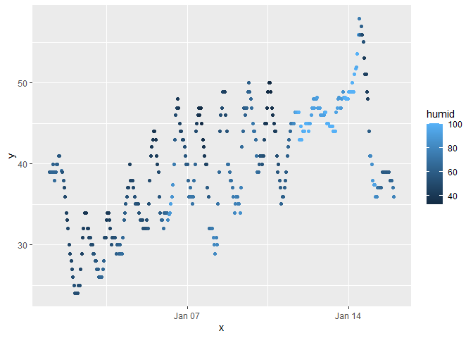

## P8015 Homework 1


```r
library(tidyverse)
library(moderndive)
library(tibble)
data("early_january_weather")
```
### Problem 1

#### About our dataset

Early January Weather describes weather details recorded at `EWR` using the `origin` variable from in `2013` from January 1 to 15. Temperature is measured in Fahrenheit with the variable `temp`and values range from 24.08 to 57.92. The variable `wind_speed` ranges from 0 to 24.16638 and humidity ranges from 32.86 to 100.

The mean temperature is 39.5821229.

In this data set, there are 358 rows and 15 columns.


```r
data.frame("early_january_weather")
x = early_january_weather$"time_hour"
y = early_january_weather$"temp"
```

#### temp vs. time_hour


```r
ggplot(early_january_weather, aes(x = x, y = y, color=humid)) + geom_point()
```

<!-- -->

```r
ggsave("scatter_plot.pdf", height = 4, width = 6)
```


The variables `time_hour` and `temp` have an positive relationship. As the scatter plot shows, as time passes throughout the day, the temperature increases.


### Problem 2

#### Creating our dataframe


```r
set.seed(1234)

random_df = tibble(
  norm_samp = rnorm(10, sd=1),
  vec_logical = norm_samp > 0,
  vec_char = c("orange", "apple", "banana", "pear", "grape", "lemon", "peach", "plum", "strawberry", "nectarine"),
  vec_factor = factor(rep(c("never", "always", "sometimes"), length.out = 10))
)
```

#### Taking means


```r
mean_norm_samp = mean(pull(random_df, norm_samp))
mean_vec_logical = mean(pull(random_df, vec_logical))
mean_vec_char = mean(pull(random_df, vec_char))
```

```
## Warning in mean.default(pull(random_df, vec_char)): argument is not numeric or
## logical: returning NA
```

```r
mean_vec_factor = mean(pull(random_df, vec_factor))
```

```
## Warning in mean.default(pull(random_df, vec_factor)): argument is not numeric
## or logical: returning NA
```

We are not able take the mean of vec_char and vec_factor because they are not numeric variable. Now, we will assign numeric values to the character variables so we can take the means. 

#### Assigning numeric values


```r
as.numeric(pull(random_df, vec_logical))
as.numeric(pull(random_df, vec_char))
```

```
## Warning: NAs introduced by coercion
```

```r
as.numeric(pull(random_df, vec_factor))
```

Here, we tried to use the as.numeric function to convert character variables to numeric variables. However, because vec_char is a nominal variable, it is non-parametric and numeric values cannot be assigned to each value. We previously dictated that vec_logical should indicate the positive values, so the as.numeric function produced binary numeric variables. Similarly, we dictated that vec_factor has 3 levels, so as.numeric converted the previously assigned levels to 1,2,and 3. 


